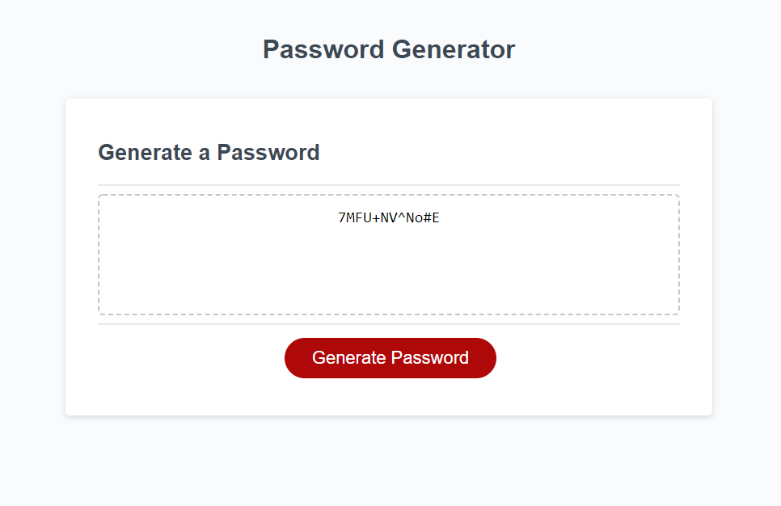

# Random Password Generator

[Live Site](http://ekerseyc.github.io/pw-generator/)

## Table of Contents
1. [Description](#Description)
2. [Usage](#Usage)
3. [Visual](#Visual)

## Description
This is a javascript password generator with multiple prompts regarding password size and what characters you want inputted.

## Usage
1. To start, press 'Generate Password'. 
2. If you want numbers in your password, press 'OK'. This will tell the generator to put numbers in your password.
3. If you want special characters in your password, press 'OK'. This will tell the generator to put special characters in your password.
4. If you want uppercase letters in your password, press 'OK'. This will tell the generator to put uppercase letters in your password.
5. The password will generate on the page.

## Visual
